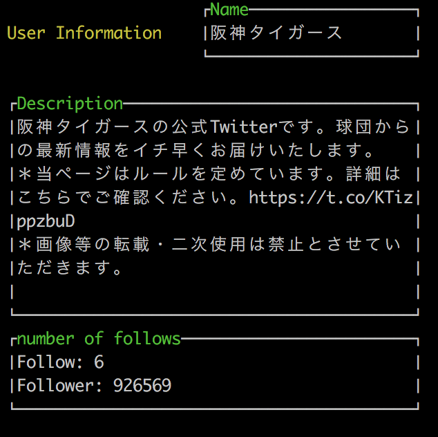

# twicli
Command line interface for Twitter

## Description  
You can control Twitter function from command line

## Installation
If you wanna use this command line, Sorry for bothering

``` sh
$ go get github.com/soeyusuke/twicli
```

And you need to set some environment variables
``` sh
$ export CON_KEY_TW="Your-Twitter-Consumer-Key"
```
``` sh
$ export CON_SECRET_KEY_TW="Your-Twitter-Consumer-Secret-Key"
```
``` sh
$ export ACC_KEY_TW="Your-Twitter-Access-Token"
```
``` sh
$ export ACC_SECRET_KEY_TW="Your-Twitter-Access-Token-Secret"
```

## Usage
You can use each sub-commands
Please see `$ twicli help`.  

### Tweet
Tweet the text which you wanna tweet
``` sh
$ twicli tweet
```

### Search
Search latest the word only 15 tweets
``` sh
$ twicli search ***
```

### Timeline
You can see own twitter timeline
``` sh
$ twicli timeline
```

### User
See the user information
``` sh
$ twicli user @***
```

#### for example `$ twicli user TigersDreamlink`



### Pictweet
You can tweet picture and text,
picture is able to use fzf search in HOME/.images
``` sh
$ twicli pictweet ***(sentence)
```

### Save
Save the image from url into HOME/.images
``` sh
$ twicli save 'url' 'imagename'
```

### Delete
Delete the image in HOME/.images
You can use fzf search
``` sh
$ twicli delete
```
